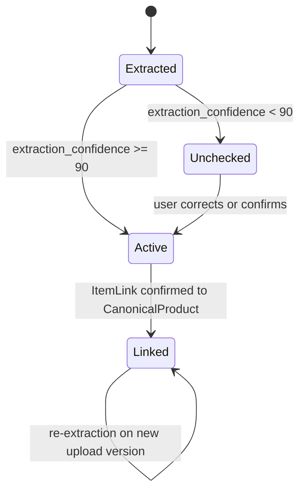
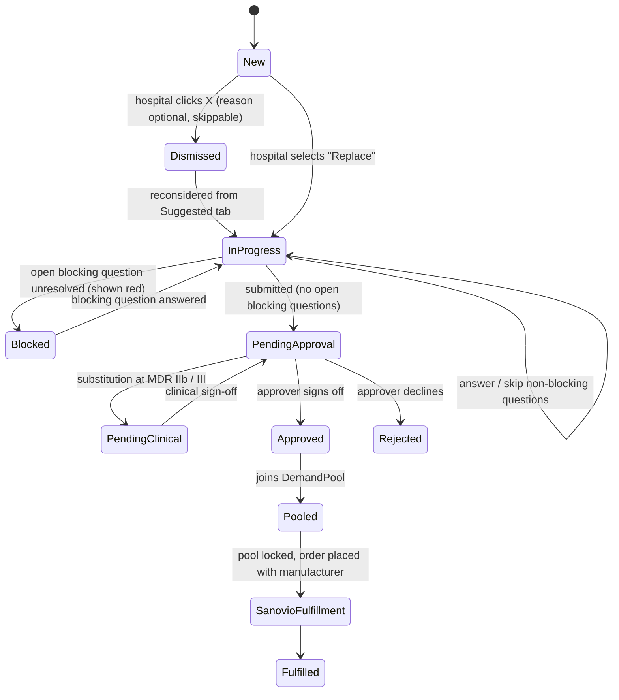
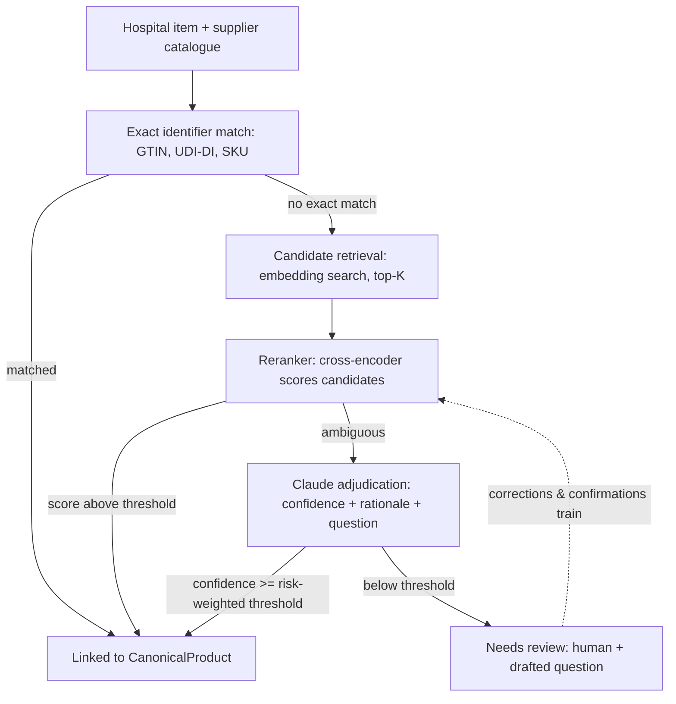

# SANOVIO — Two-Sided Procurement Platform, Structure v2

MVP structure for the matching-and-ordering half of SANOVIO's platform: hospital and supplier data in, harmonised product identity in the middle, recommendations and pooled orders out.

**v2 changes:** added canonical product identity (§1.3), demand pooling (§1.5), the identity-vs-substitution distinction (§1.6), a risk-weighted confidence model (§2), and corrected the matching-engine and structured-output sections (§8, §9). v1 modelled a substitution recommender; v2 models a buying group.

---

## 0. What the platform is

SANOVIO is a **virtual procurement group** (*virtuelle Einkaufsgemeinschaft*) for hospitals. Three mechanics stack:

1. **Data harmonisation** — hospital article masters and supplier catalogues are messy, inconsistently named, and inconsistently unitised. Cleaning them into one product identity is the precondition for everything else.
2. **Demand pooling** — once two hospitals provably buy the same thing, their volume can be bundled into one negotiating position.
3. **Direct-to-manufacturer sourcing** — the pooled volume is placed with the original manufacturer, removing the distributor margin layer. SANOVIO operates the supply chain itself (manufacturer → hospital warehouse), so it is principal in the transaction, not a broker.

The savings story is therefore mostly **channel**, not **substitution**: the same product bought better. That distinction drives the whole data model below.

---

## 1. Core Entities

### 1.1 User
| Field | Notes |
|---|---|
| id | |
| name, email | |
| role | `hospital_buyer`, `hospital_approver`, `supplier_user`, `sanovio_admin` |
| organization_id | FK → Hospital or Supplier |

### 1.2 Raw extracted items

#### SupplierCatalogItem
| Field | Notes |
|---|---|
| id | |
| supplier_id | |
| source_document_id | which upload this came from |
| extracted_name, extracted_sku, extracted_price, extracted_spec | raw AI output |
| extracted_gtin, extracted_udi_di | nullable — the golden path when present |
| extracted_pack_size, extracted_uom | needed for unit-price normalisation |
| extraction_confidence | 0–100 |
| status | `unchecked` → `active` |
| canonical_product_id | nullable until linked (§1.3) |
| corrected_by, corrected_at | nullable |
| raw_extraction_payload | for audit/debugging |

#### HospitalPurchaseItem
Same shape, scoped to `hospital_id`, plus `annual_volume` and `current_unit_price` (needed for savings math) and `current_supplier_name` (usually a distributor — this is what gets displaced).

**Rule:** items below the extraction threshold never enter the matching engine. They sit in a review queue until a human confirms or corrects them — symmetric on both sides.

### 1.3 CanonicalProduct — the harmonisation layer

The single most important addition in v2. Without it, matching is `hospital_item ↔ supplier_item` directly: every hospital re-discovers the same equivalences independently, a correction by Hospital A teaches the system nothing about Hospital B, and volume can never be pooled because nothing asserts that two hospitals buy the same thing.

| Field | Notes |
|---|---|
| id | |
| canonical_name | harmonised display name |
| manufacturer_id | the *original* manufacturer, not the distributor |
| gtin, udi_di | nullable, but authoritative when present |
| eclass_code | ECLASS classification (see §10 — DACH standard) |
| base_uom, base_pack_size | everything normalises to a comparable unit price |
| mdr_risk_class | `I`, `IIa`, `IIb`, `III` — drives thresholds in §2 |
| attributes | JSON: material, size, sterility, latex-free, coating, … |
| verified_by, verified_at | nullable — human-confirmed canonical records |

Matching becomes `hospital_item → CanonicalProduct ← supplier_item`. This collapses M×N to M+N, makes harmonisation an asset that **compounds across customers**, and is the only structure in which demand pooling is expressible.

### 1.4 ItemLink — item to canonical product

| Field | Notes |
|---|---|
| id | |
| item_type, item_id | hospital or supplier item |
| canonical_product_id | |
| link_confidence | 0–100 — "is this row the same thing as that canonical product" |
| link_method | `gtin_exact`, `udi_exact`, `sku_exact`, `reranked`, `llm_adjudicated`, `human` |
| status | `proposed`, `confirmed`, `rejected` |

### 1.5 DemandPool, PooledDemand, PriceTier — the buying group

This is the business model made explicit in the schema.

#### DemandPool
| Field | Notes |
|---|---|
| id | |
| canonical_product_id | |
| period | e.g. `2026-Q4` or a contract window |
| total_committed_volume | sum of committed PooledDemand |
| total_indicative_volume | includes non-committed interest |
| current_tier_id | FK → PriceTier reached at current volume |
| status | `forming`, `locked`, `contracted` |

#### PooledDemand
| Field | Notes |
|---|---|
| id | |
| demand_pool_id, hospital_id | |
| annual_volume | |
| commitment | `indicative` or `committed` |
| committed_at | |

#### PriceTier
| Field | Notes |
|---|---|
| id | |
| supplier_id, canonical_product_id | |
| min_volume, unit_price, currency | volume-break pricing from the manufacturer |
| valid_from, valid_until | |

**Why this matters in the product, not just the schema:** the hospital's price improves as the pool grows. That is a visible network effect — the recommendation card can show *"your price today"* alongside *"price if the pool reaches X units"*. It gives hospitals a reason to commit early and a reason to care whether peers join.

### 1.6 Recommendation — two distinct kinds

v1 had one `Match`. There are really two, with very different risk profiles:

| | **Identity match** | **Substitution match** |
|---|---|---|
| Claim | Same product, better channel | Different product, clinically equivalent |
| Savings source | Distributor margin removed | Product switch |
| Clinical risk | **None** — it is the same article | Real — needs clinical judgement |
| Approval path | Procurement only | Procurement + clinical sign-off for higher risk classes |

| Field | Notes |
|---|---|
| id | |
| type | `identity` or `substitution` |
| hospital_item_id | |
| canonical_product_id | what the hospital buys today |
| recommended_canonical_product_id | same as above for `identity`; different for `substitution` |
| demand_pool_id | nullable — which pool this order would join |
| savings_amount, savings_pct | computed at the pool's current tier |
| match_confidence | for `substitution` only — equivalence confidence |
| status | see state machine in §5 |
| dismissed_reason | nullable |
| created_at, updated_at | |

Identity matches should be surfaced first: they are lower risk, faster to approve, and where most of the money is. Substitution is the higher-effort, higher-friction play.

### 1.7 Question
| Field | Notes |
|---|---|
| id | |
| recommendation_id | |
| type | `blocking` (red) / `non_blocking` |
| text | |
| asked_by | hospital user |
| routed_to | `supplier` or `sanovio_internal` |
| answer_text, answered_by | nullable |
| status | `open`, `answered`, `skipped` |

### 1.8 Order
| Field | Notes |
|---|---|
| id | |
| recommendation_id, hospital_id, requested_by | |
| demand_pool_id | the pool this order joins |
| status | see §5 |
| approver_id, approved_at | nullable until approval |
| clinical_approver_id | required for substitution at MDR IIb / III |
| sanovio_fulfillment_ref | SANOVIO is principal and operates the logistics leg |

### 1.9 CorrectionLog
`item_type`, `item_id`, `field_changed`, `old_value`, `new_value`, `corrected_by`, `corrected_at` — every correction is both an audit record and a labelled training example (§8).

---

## 2. Confidence model — three thresholds, not one

v1 applied a single 90% bar to everything. Extraction confidence and equivalence confidence have different distributions and *wildly* different costs of error: a misread price is embarrassing, a wrong substitution on an implantable is a patient-safety and MDR liability event.

| Threshold | Question it answers | Default | Cost of being wrong |
|---|---|---|---|
| `extraction_confidence` | Did we read this row correctly? | 90 | Wrong number shown; recoverable |
| `link_confidence` | Is this row the same article as this canonical product? | 95 | Wrong product ordered; serious |
| `substitution_confidence` | Are these two *different* articles clinically interchangeable? | risk-weighted ↓ | Patient safety; regulatory |

### Substitution threshold by MDR risk class

| MDR class | Examples | Auto-confirm threshold |
|---|---|---|
| I | Gauze, non-sterile consumables | 90 |
| IIa | Sutures, cannulas | 95 |
| IIb | Infusion pumps, ventilator circuits | 98 |
| III | Implants, stents, heart valves | **Never auto** — always human + clinical sign-off |

Class III substitution never clears automatically regardless of model confidence. Identity matches are exempt from the substitution threshold entirely — there is no clinical decision in buying the same article through a different channel.

---

## 3. Extraction & Harmonisation Flow (both sides, symmetric)



- `Unchecked` items surface **at the top of the page** as a banner/queue — not buried in a tab. Once cleared, backlog lives under an "Unchecked" tab.
- Only `Linked` items feed pooling and recommendations. A bad extraction can never silently produce a wrong savings claim.
- If a supplier corrects an item powering a live recommendation, re-score automatically: silent update when the savings delta is small, re-surface as "updated" when material (threshold ~5%).
- Corrections propagate through the canonical product, so one fix improves every hospital linked to it.

---

## 4. Recommendation Card

```
┌──────────────────────────────────────────────┐
│  IDENTITY MATCH · same article, direct        │  ← type badge
│  Currently: Ethicon Vicryl 3-0 via Distributor│  ← small, muted
│                                               │
│  Ethicon Vicryl 3-0 — direct                  │  ← large, bold
│                                               │
│                        -34%  ████████         │  ← large, colour-coded
│                        Pool: 12 hospitals     │
│                        -41% at 50k units      │  ← next tier incentive
└──────────────────────────────────────────────┘
```

**Colour scale, recalibrated.** v1 topped out at ">20% = bold green", which saturates immediately if typical savings run 30–50% — the scale stops discriminating exactly where it matters. Scale to the observed distribution instead:

| Savings | Treatment |
|---|---|
| < 10% | neutral / grey |
| 10–25% | green |
| 25–40% | bold green |
| > 40% | bold green + emphasis marker |

Re-fit these bands once real data exists; the principle is that the top band should contain a *minority* of cards.

Substitution cards carry a visually distinct badge and, for MDR IIb/III, an explicit "clinical review required" marker — the hospital should never confuse "same thing, cheaper" with "different thing, we think it's equivalent".

---

## 5. Match → Order Flow



Key gates:
- **Submission is blocked (red) while any blocking question is open.** Non-blocking questions can be skipped.
- **Clinical sign-off is a separate gate from budget approval** for substitutions at MDR IIb/III. Different person, different question. Identity matches skip it entirely.
- **Approved orders join a pool rather than dispatching immediately.** This is the mechanic that produces the price — worth showing the hospital where their pool stands and when it locks.

**Dismiss flow:** clicking X opens a lightweight reason picker (price too close / wrong spec / don't trust supplier / already contracted / clinical objection / other) with a visible **Skip**. Either way the recommendation moves to the Suggested tab — never deleted, always reconsiderable. Dismissal reasons are labelled training data (§8).

**Approval:** `hospital_buyer` builds up to submission; only `hospital_approver` can move `PendingApproval → Approved/Rejected`.

---

## 6. Supplier-Side Flow

1. Log in → upload catalogue file
2. AI extracts items → confidence scored
3. Below threshold → surfaced at top as "needs review"; above → auto-active
4. Items link to canonical products (GTIN/UDI first, then the §8 pipeline)
5. Supplier confirms links and maintains volume-break `PriceTier` rows
6. Supplier sees aggregated pooled demand per canonical product — the actual pitch to a manufacturer: *"12 hospitals, 50k units, one order"*
7. Inbound questions tied to specific items, answered inline

## 7. Hospital-Side Flow

1. Log in → upload purchase spreadsheet / article master export
2. AI extracts → confidence gate → harmonisation to canonical products
3. Linked items feed pooling and recommendations; cards appear top of dashboard, identity matches first, then by savings
4. Per card: dismiss or open detail → questions → submit → approval (+ clinical if required) → pool → fulfilment
5. Natural-language search over the same harmonised catalogue — user-initiated rather than system-suggested, same retrieval layer underneath (§8)

---

## 8. Matching Engine Architecture

Not a single trained model — a layered pipeline. Training a matcher from scratch needs thousands of labelled pairs that don't exist yet; this works from day one and gets cheaper as usage builds a training set.



- **Exact identifier match (free).** GTIN, EU MDR **UDI-DI**, manufacturer part numbers. MDR makes UDI mandatory for devices placed on the EU market, so manufacturer-side coverage is good; the gap is on the **hospital** side, where article masters are legacy free text. That gap is precisely what harmonisation sells.
- **Candidate retrieval.** Embed item descriptions, pull top-K plausible candidates rather than comparing every hospital item against every supplier item. Use **Voyage 4** (`voyage-4-lite` / `voyage-4` / `voyage-4-large` share an embedding space, so you can start cheap and upgrade without re-indexing) — Anthropic does not ship its own embedding model and points to Voyage as its embeddings partner. Voyage also offers healthcare domain-tuned models, directly relevant here. First 200M tokens are free, which likely covers the entire pilot corpus. pgvector is a fine v1 store.
- **Reranker.** Voyage ships a reranker off the shelf, so this layer exists **before** there is any training data. It is also the layer that corrections train — not the embedding model. Most pairs resolve here without an LLM call.
- **Claude adjudication.** Runs only on what the reranker leaves ambiguous. One call returns confidence, rationale, and — if uncertain — the clarifying question, using the schema in §9.
- **Feedback loop.** Every correction, dismissal reason, and confirmed order is a labelled example. As volume builds, a fine-tuned reranker takes over more of the middle, with Claude reserved for the genuinely ambiguous long tail.
- **Manual search reuses the same retrieval layer** — same index, user-triggered instead of system-triggered.

---

## 9. Structured Output Enforcement (Claude Adjudication Step)

Plain prompting for JSON is usually reliable but not guaranteed — stray text, markdown fences, or a missing field can slip through. Anthropic's **Structured Outputs** removes that risk at the decoding level rather than through prompting. For adjudication, `output_config.format` is the right fit — this is a classification task, not an action.

```typescript
import Anthropic from "@anthropic-ai/sdk";
import { z } from "zod";
import { zodOutputFormat } from "@anthropic-ai/sdk/helpers/zod";

const AdjudicationSchema = z.object({
  relation: z.enum(["identical", "equivalent", "not_equivalent"]),
  confidence: z.number().int().min(0).max(100),
  rationale: z.string(),
  differing_attributes: z.array(z.string()),
  needs_clarification: z.boolean(),
  question_text: z.string(),
  question_type: z.enum(["blocking", "non_blocking"]),
});

const client = new Anthropic();

const response = await client.messages.parse({
  model: "claude-opus-5",
  max_tokens: 16000,
  output_config: {
    format: zodOutputFormat(AdjudicationSchema),
    effort: "medium",
  },
  messages: [{ role: "user", content: matchAdjudicationPrompt }],
});

// parsed_output is null if parsing failed - guard before use
const result = response.parsed_output!;
```

Notes:

- **`claude-opus-5`** — adjudicating medical-device equivalence is judgement-heavy work that justifies the strongest model. Control cost with `effort` (`low`/`medium`/`high`/`xhigh`/`max`) rather than by downgrading the model. `claude-sonnet-5` is a reasonable cost step-down once measured against an eval.
- **`messages.parse()` over `messages.create()`** — it validates the response against the schema and hands back `parsed_output` instead of leaving you to check fields by hand.
- **`relation` is three-valued, not boolean.** `identical` routes to an identity match (no clinical gate); `equivalent` routes to substitution and hits the risk-weighted threshold from §2. Collapsing these loses the most important distinction in the model.
- **`differing_attributes`** gives the hospital something concrete to evaluate and makes the drafted question specific rather than generic.
- Every object in the schema needs `additionalProperties: false` — the Zod helper handles this.
- No optional fields — when `needs_clarification` is `false`, `question_text` is an empty string rather than omitted.
- **This guarantees syntax, not accuracy.** Claude can still be confidently wrong about equivalence — that is what the risk-weighted human-review gate in §2 is for. Structured outputs eliminate plumbing failures, not judgement failures.

---

## 10. Market Context

The incumbent being displaced is not a spreadsheet — it is an established e-procurement layer.

- **GHX** (Global Healthcare Exchange) acquired **Medical Columbus** in 2018, giving it the DACH hospital procurement market. Its `mc navigator` is a classified database of 6M+ medical and pharmaceutical products across DE/CH/AT/LU/NL, with up to 17 classification levels.
- **ECLASS** (ISO/IEC-compliant) is the classification standard German GPOs standardised on; **GS1 GDSN** is the data-synchronisation backbone. Building canonical products on ECLASS codes rather than a bespoke taxonomy is both cheaper and a migration path for hospitals already carrying those codes.
- **EU MDR** mandates UDI for devices on the EU market — the identifier layer in §8 rests on a regulatory requirement, not on voluntary supplier hygiene.

**The differentiation argument:** GHX is a *transaction* layer over the hospital's **existing distributor relationships** — it makes the current supply chain more efficient. SANOVIO **replaces** the distributor by pooling demand and sourcing direct. The catalogue is table stakes; the buying group is the product. A structure document that doesn't name the incumbent reads as though it hasn't looked.

---

## Open items for next pass

- **Pool mechanics**: when does a pool lock? Rolling, or fixed windows? What happens to a hospital that commits after lock?
- **Commitment enforcement**: is `committed` contractually binding? If a hospital withdraws after a tier price was struck, who absorbs the difference?
- **Canonical product governance**: who owns a canonical record when two suppliers disagree about equivalence — SANOVIO, or the manufacturer?
- **Threshold calibration**: the numbers in §2 are reasoned defaults, not measured. They need an eval set of labelled pairs before they mean anything.
- **Reranker timeline**: how many corrections and confirmed orders before fine-tuning beats the off-the-shelf Voyage reranker?
- **Notifications**: supplier pinged on blocking questions? Approver pinged on submission? Hospital pinged when its pool reaches the next tier?
- **Re-match cadence**: on-correction only, or nightly re-score against updated catalogues and price tiers?
- **Roles at smaller hospitals**: can buyer = approver? Can procurement approve clinical substitutions at Class I?

Next candidates: API endpoint definitions, DB schema (DDL), or the adjudication prompt + eval set.
